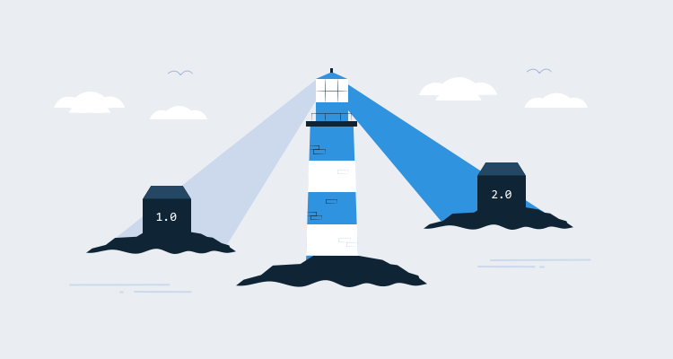

In a previous post this year, I wrote [about the benefits of the rolling deployment pattern](/blog/2020-01/ultimate-guide-to-rolling-deployments/index.md) as a way to reduce application downtime when deploying. Designing an application to fit this deployment pattern is arguably much easier when you are first creating it. But where do you start with an application you already have, and how do you take an existing application and convert it to use the rolling deployment pattern?

In this post, I'll show you how to convert an existing application to use the rolling deployments pattern in Octopus with the help of [Child Steps](https://octopus.com/docs/deployment-patterns/rolling-deployments#Rollingdeployments-Childsteps).

<h2>In this post</h2>

!toc

## TODO

:::success
**Sample Octopus Projects**
You can see the before and after of the project conversion discussed here in our samples instance.

- [PetClinic project - with no rolling deployments](https://g.octopushq.com/PatternRollingSamplePetClinicNoRollingDeploy)
- [PetClinic project - with rolling deployments](https://g.octopushq.com/PatternRollingSamplePetClinicRollingDeploy)
:::

## Conclusion

